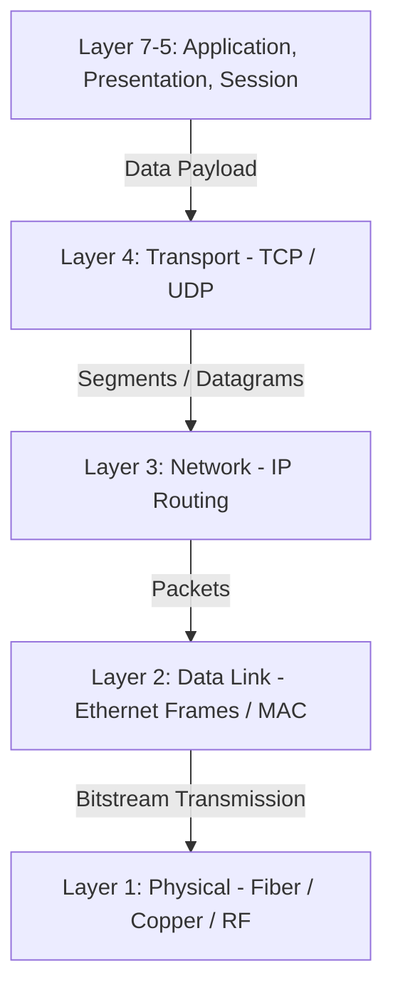

<div align="center">

# 🖥️ Information Technology Systems Architecture Framework

**Enterprise Hardware Architectures, Operating System Internals, Network Protocols & Emerging Technologies**

[]()
[]()
[]()
[](LICENSE)

</div>

---

## 📌 Portfolio Overview

**Information Technology Systems Architecture Framework** is a foundational computer systems portfolio demonstrating deep technical understanding of compute hardware, operating system architectures, network transmission protocols, and enterprise IT infrastructures. Developed under **Pearson BTEC Higher National / Level 3 IT - Unit 01: Information Technology Systems**, this project covers the full engineering spectrum of enterprise computing.

---

## 🎯 Covered Learning Activities & Engineering Domains

| BTEC Learning Activity | Technical Focus Area | Key Artifacts & Deliverables |
| :--- | :--- | :--- |
| **Activity 1 (نشاط 1)** | **Hardware Systems & Computer Architecture** | CPU architecture (ALU, Control Unit, Registers), memory hierarchies (Cache L1-L3, RAM, NVMe SSD), I/O bus architectures, and server motherboard topologies. |
| **Activity 2 (نشاط 2)** | **Software Paradigms & Operating Systems** | OS kernel architectures (Monolithic vs. Microkernel), process scheduling algorithms, virtual memory management, and enterprise utility software. |
| **Activity 3 (نشاط 3)** | **Data Communications & Network Infrastructure** | Transmission media (Single-mode/Multi-mode Fiber, Cat6/7 Twisted Pair, Wi-Fi 6), OSI 7-layer & TCP/IP stack mapping, routing protocols, and error detection (CRC). |
| **Activity 4 (نشاط 4)** | **Societal, Ethical & Emerging Technologies** | Digital transformation impact, Green Computing power efficiency, GDPR/Data Privacy compliance, and emerging edge/cloud paradigms. |

---

## 🌐 Layered Network & Compute Architecture (OSI Model)



---

## 📂 Project Structure

```text
it-systems-architecture-portfolio/
├── assets/                                    # Architecture & Topology Diagrams
│   └── diagrams/
├── docs/                                      # BTEC Unit 01 Reports & Assignment Briefs
│   ├── BTEC_Unit01_IT_Systems_Brief.pdf
│   ├── IT_Infrastructure_Hardware_Activity_1.docx
│   ├── Software_Paradigms_OS_Activity_2.docx
│   ├── Data_Communication_Networks_Activity_3.docx
│   └── Societal_Impact_Emerging_Tech_Activity_4.docx
├── src/                                       # Python Hardware & Network Diagnostics
│   ├── __init__.py
│   ├── system_diagnostics.py                  # Workstation compute & OS architecture profiler
│   ├── network_bandwidth_analyzer.py          # Transmission delay & bandwidth-delay product simulator
│   └── main.py                                # Interactive IT Systems CLI runner
├── LICENSE                                    # MIT License
└── README.md                                  # Comprehensive portfolio documentation
```

---

## 🚀 Running the IT Systems Diagnostics Utility

```bash
# 1. Clone the repository
git clone https://github.com/your-username/it-systems-architecture-portfolio.git
cd it-systems-architecture-portfolio

# 2. Run the system diagnostics script
python src/main.py
```

---

## 📄 License

This project is open-source and licensed under the [MIT License](LICENSE).

---

## 👨‍💻 Author

Developed by **Mamoun Sraiheen**  
*Passionate Computer Systems, Software Engineering & IT Student*
